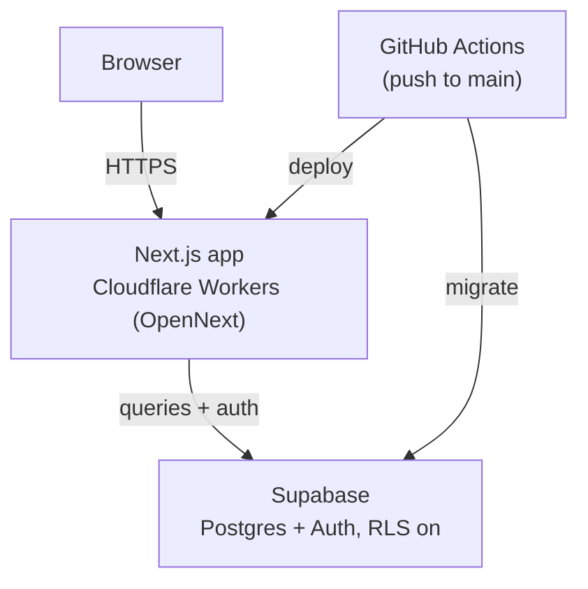

# Bokcirkeln — Technical Overview

A Next.js app on Cloudflare Workers with Supabase for auth and data, deployed
automatically from GitHub Actions on every push to `main`.

> This file is a version-controlled mirror of the living doc at
> https://claude.ai/artifact/V7PYxurCmE5GAqr5UKmFyf — kept in sync as the
> project changes. Edit either; ask Claude to reconcile them if they drift.

## Architecture

A push to `main` builds and deploys the app to Cloudflare Workers while
running any new Supabase migrations; the browser only ever talks to the
Next.js app, never directly to Supabase.

## Database schema

Seven tables in the `public` schema of the `wzwuxaqvbsnpwpfagvmg` Supabase
project, all with row level security on (public read, writes scoped to the
acting member or admin-only).

### members

| Column | Type | Notes |
| --- | --- | --- |
| id | uuid, PK | = `auth.users.id` |
| display_name | text, nullable | Only set from the auth `full_name`; null members are hidden in the UI |
| created_at | timestamptz | |
| is_admin | boolean | Grants rights to edit/delete books and lock admin-only controls; only settable via SQL, never through the app |

A trigger (`handle_new_member`) inserts a row on every `auth.users` signup.

### books

| Column | Type | Notes |
| --- | --- | --- |
| id | uuid, PK | |
| title, author | text | |
| status | text | one of `suggested`, `current`, `read`, `hidden` (a passed-over suggestion, kept but off the main list) |
| cover_url, description, original_title, published_year | text / text / text / int, nullable | book metadata, e.g. from Open Library |
| pitch | text, nullable | why it was suggested |
| added_by | uuid, FK → members | who suggested it |
| finished_at | timestamptz, nullable | set when marked read |
| created_at | timestamptz | |

### reviews

| Column | Type | Notes |
| --- | --- | --- |
| id | uuid, PK | |
| book_id | uuid, FK → books | |
| member_id | uuid, FK → members | |
| rating | smallint | 1–5 |
| body | text, nullable | |
| created_at | timestamptz | |

Unique on `(book_id, member_id)` — one review per member per book (later
edits upsert).

### suggestion_votes

| Column | Type | Notes |
| --- | --- | --- |
| book_id | uuid, FK → books, PK | |
| member_id | uuid, FK → members, PK | |
| created_at | timestamptz | |

Composite primary key — one vote per member per suggestion.

### background_covers

| Column | Type | Notes |
| --- | --- | --- |
| id | uuid, PK | |
| position | integer | display order in the collage |
| cover_url | text | |
| title | text, nullable | caption, e.g. from Open Library |
| added_by | uuid, FK → members, nullable | |
| created_at | timestamptz | |

The faded book-cover collage behind the page. Public read; only admins can
add, replace or delete covers (RLS + `requireAdmin` in the Server Actions),
via the "Background images" panel at the bottom of the page. Seeded with the
covers that used to be hardcoded in `page.tsx`; if ever emptied, the page
falls back to that original hardcoded list rather than showing nothing.

### background_settings

| Column | Type | Notes |
| --- | --- | --- |
| id | boolean, PK, default true | always `true` — a `check (id)` constraint keeps this a single-row table |
| cols_mobile | integer, default 4 | collage columns below the `sm` breakpoint (640px) |
| cols_tablet | integer, default 7 | collage columns at `sm` (640px) and up |
| cols_desktop | integer, default 9 | collage columns at `lg` (1024px) and up |
| gap_x_percent | integer, default 30 | horizontal gap, as a % of a tile's own width |
| gap_y_percent | integer, default 30 | vertical gap, as a % of a tile's own height |
| grayscale | boolean, default true | `false` shows the covers in color (still faded, just less so) |
| updated_at | timestamptz | |

Admin-configurable layout for the background collage, edited via
`BackgroundSettingsForm` in the "Background images" panel. Public read; only
admins can update (RLS + `requireAdmin`). `page.tsx`'s `BookCoverBackground`
turns these into a scoped `<style>` block (Tailwind can't generate classes
from a runtime/DB value), and picks how many cover tiles to render by taking
the LCM of the three column counts (capped at 120) so the last row is always
full at every breakpoint, rather than a fixed tile count that ignored how
many covers actually exist. Horizontal and vertical gap were originally one
shared `gap_percent` column/CSS `gap` shorthand; split into independent
`gap_x_percent`/`gap_y_percent` (and `column-gap`/`row-gap`) so resizing one
axis doesn't affect the other.

### notes

The original scaffold's starter table (title + created_at). Still present,
unused by the book club UI.

## Auth

Supabase Auth, via `@supabase/ssr`, with two sign-in paths on `/login`: a
magic link (`signInWithOtp`) or, if a password's been set,
`signInWithPassword`. A member can add a password later from
`/account/password`.

1. Magic link → emailed link hits `/auth/confirm?code=...` →
   `exchangeCodeForSession` (PKCE) → redirected to `/`.
2. `src/proxy.ts` runs `updateSession` (in `src/lib/supabase/middleware.ts`)
   on every request to refresh the session cookie.
3. On first signup, a database trigger (`handle_new_member`) inserts a row
   into `members`, with `display_name` set from the auth `full_name` if
   present, otherwise left null.

Server Components read the session via `src/lib/supabase/server.ts`
(cookie-based, request-scoped); Client Components use
`src/lib/supabase/client.ts`.

Books already in the club's history (currently reading / books read) can
only be changed by admins — a boolean `is_admin` flag on `members`, checked
both in the Server Actions (`requireAdmin`) and via RLS, so the restriction
holds even outside the UI. Suggesting a book, voting and reviewing stay open
to every signed-in member.

## Key files

| Path | What it does |
| --- | --- |
| `src/app/page.tsx` | The whole club page — currently reading, suggestions, books read, members, background-images admin panel — plus the faded book-cover background |
| `src/app/actions.ts` | Server Actions: `addSuggestion`, `toggleVote`, `addReview`, `deleteReview`, `markAsCurrent`, `finishCurrentBook`, `updateBookDetails`, `addReadBook`, `hideSuggestion`, `unhideSuggestion`, `deleteBook`, `addBackgroundCover`, `replaceBackgroundCover`, `deleteBackgroundCover`, `reorderBackgroundCovers`, `updateBackgroundSettings`, `signOut` |
| `src/app/BackgroundSettingsForm.tsx` | Admin-only form for the background collage's column counts and horizontal/vertical gap |
| `src/app/SuggestBookForm.tsx`, `src/app/AddReadBookForm.tsx` | Client components for the two "add a book" forms; each clears itself (via a remount-on-success key) after a successful submit, and shows the error inline on failure without losing what was typed |
| `src/app/BookSearchFields.tsx` | Client component: title/author/cover/description fields with a debounced "search Open Library" box above them that fills the fields in on pick; used inside both forms above |
| `src/app/FinishedAtField.tsx` | Client component: the "Finished on" date field, validating a full "YYYY-MM-DD" with a sane year (1000–2100) as the person types — the same check the server applies, mirrored client-side so a bad value never reaches it |
| `src/app/BackgroundCoverAdmin.tsx` | Admin-only panel for the background collage: drag-and-drop reorder, replace or remove any current cover, or add another, each via `CoverSearchPicker` |
| `src/app/CoverSearchPicker.tsx` | Client component: a debounced "search Open Library for a cover" box (like `BookSearchFields`, but returns just a cover URL + caption); used by `BackgroundCoverAdmin` |
| `src/app/api/book-search/route.ts` | Signed-in-only proxy to Open Library's search API (`openlibrary.org/search.json`), shaped to what `BookSearchFields`/`CoverSearchPicker` need |
| `src/app/api/book-details/route.ts` | Signed-in-only proxy that fetches one Open Library work's description once a search result is picked, kept separate from the search route so typing doesn't fetch descriptions for results nobody chose |
| `src/app/ConfirmSubmitForm.tsx` | Confirm-before-submit wrapper used for delete buttons (books, reviews, background covers) |
| `src/app/login/page.tsx` | Magic-link + password sign-in |
| `src/app/account/password/page.tsx` | Set or change password |
| `src/app/auth/confirm/route.ts` | PKCE code exchange after a magic-link click |
| `src/lib/supabase/{client,server,middleware}.ts` | Supabase clients for the browser, Server Components, and session refresh |
| `src/proxy.ts` | Runs `updateSession` on every request (Next.js 16 renamed "middleware" to "proxy") |
| `supabase/migrations/*.sql` | Schema as code, applied by `supabase db push` (or the Deploy workflow) |
| `wrangler.jsonc`, `open-next.config.ts` | Cloudflare Worker config via the OpenNext adapter |
| `.github/workflows/ci.yml` | Lint + build on every PR |
| `.github/workflows/deploy.yml` | Migrate DB, then build + deploy to Cloudflare, on every push to `main` |

## Migration history

| Version | Name | What it did |
| --- | --- | --- |
| 20260930204752 | book_club_background_settings_grayscale | Added `background_settings.grayscale` (default `true`) |
| 20260930153202 | book_club_background_settings_split_gap | Split `background_settings.gap_percent` into `gap_x_percent`/`gap_y_percent` |
| 20260930151854 | book_club_background_settings | Added `background_settings` (single-row, public read, admin-only writes): collage column counts per breakpoint and gap |
| 20260930135649 | book_club_background_covers | Added `background_covers` (public read, admin-only writes), seeded with the covers previously hardcoded in `page.tsx` |
| 20260930122645 | book_club_hidden_suggestions | Added `hidden` to the `books.status` check constraint, for suggestions passed over without deleting them |
| 20260930111637 | book_club_admin_lock_down_trigger_fn | Revoked public execute on the `prevent_self_admin_change` trigger function |
| 20260930111623 | book_club_admin | Added `members.is_admin`, a self-promotion guard trigger, and restricted book update/delete to admins via RLS |
| 20260927184457 | book_club_display_name_nullable | `display_name` nullable — no more falling back to an email-derived name |
| 20260927184354 | book_club_display_name_from_metadata | Prefer the auth `full_name` over an email-derived name |
| 20260927183623 | book_club_book_metadata | Added `description`, `original_title`, `published_year` to `books` |
| 20260927182000 | book_club_backfill_members | Backfilled member rows for accounts that predated the signup trigger |
| 20260927181144 | book_club_lock_down_trigger_fn | Revoked public execute on the `handle_new_member` trigger function |
| 20260927181131 | book_club | Created `members`, `books`, `reviews`, `suggestion_votes`, RLS policies, seed data |
| 20260921143418 | notes | Starter table from the original scaffold |

All applied directly to the live Supabase project; the matching `.sql`
files in `supabase/migrations/` keep the repo's history in sync so
`supabase db push` recognizes them as already applied.
